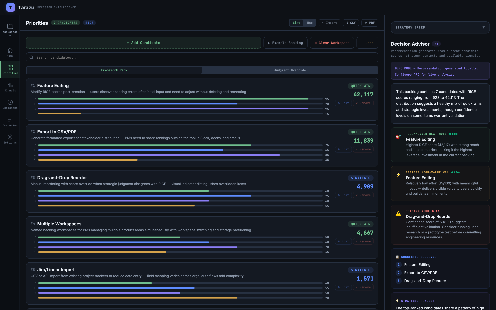
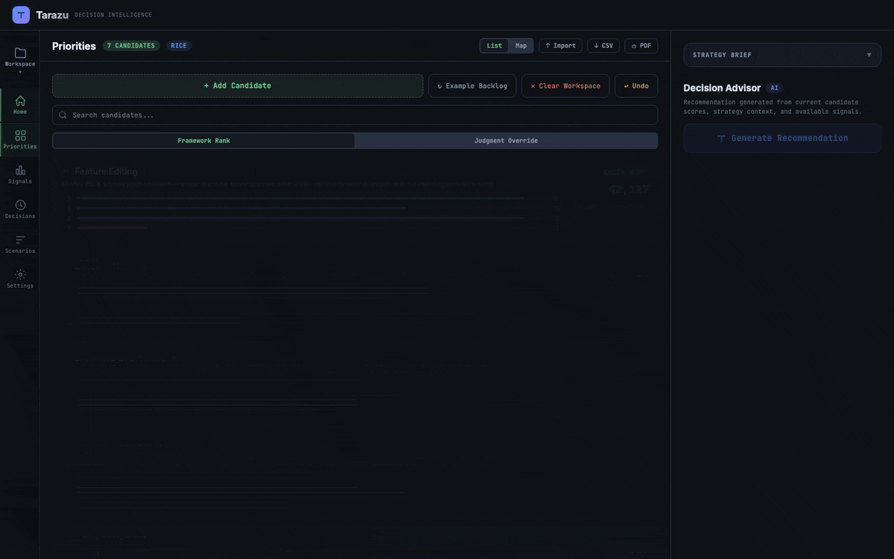
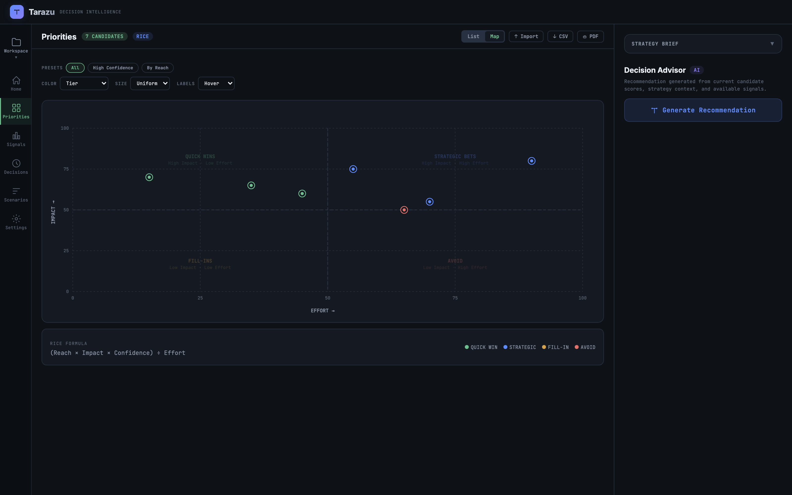
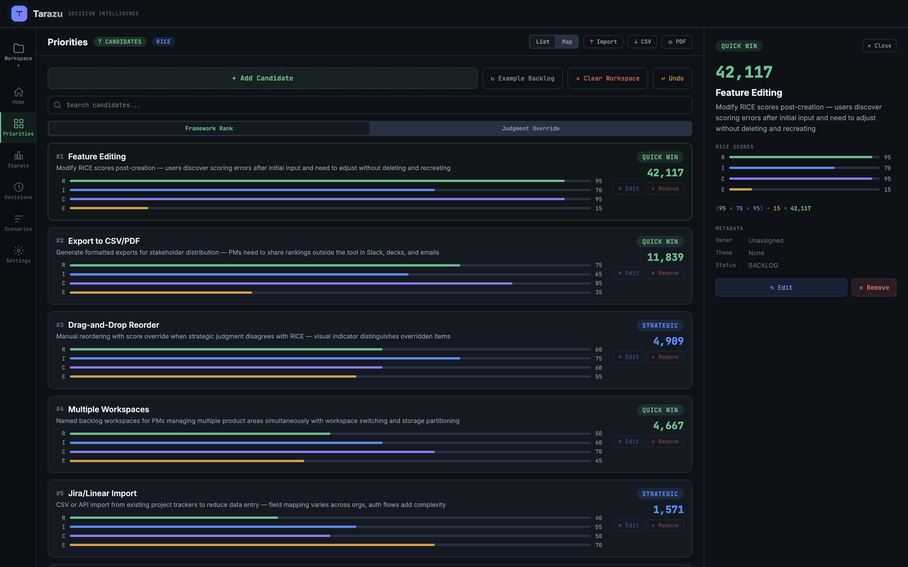
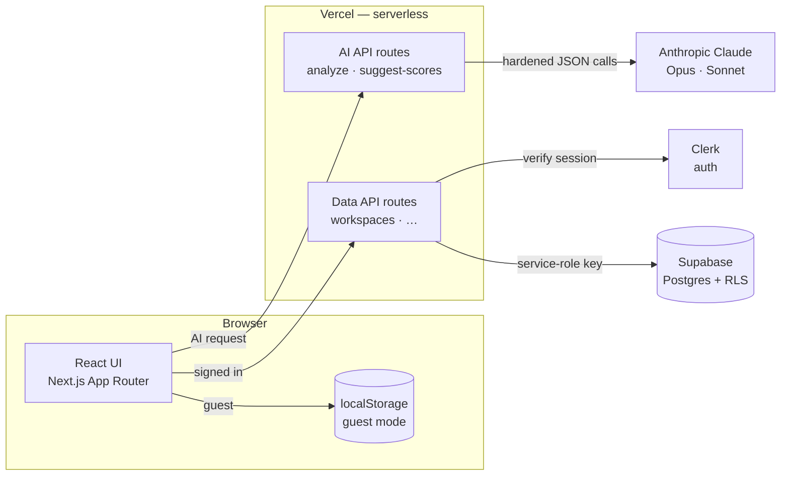

# Tarazu

**Decision intelligence for product teams. Weigh what matters.**

Tarazu helps product teams prioritize ideas, compare tradeoffs, capture context, and generate explainable recommendations with structured frameworks like RICE — powered by Claude.

[**→ Live Demo**](https://tarazu.kristenmartino.ai) · [**→ Read the PRD**](./docs/Tarazu_PRD.pdf)



*RICE-scored candidates on the left, the AI Decision Advisor's recommendation on the right. [Try it live →](https://tarazu.kristenmartino.ai)*

---

## What It Does

| Feature | Description |
|---------|-------------|
| **Normalized RICE Scoring** | Slider-based input for each dimension on a 1–100 scale with real-time score calculation |
| **Priority Matrix** | Canvas-rendered Effort vs. Impact scatter plot with labeled quadrants |
| **AI Strategy Advisor** | One-click backlog analysis via Claude Opus — returns top priority, quick win, risk flag, sprint plan, and strategic insight |
| **AI Score Suggestions** | Per-candidate scoring via Claude Sonnet, grounded in product context and prior feedback |
| **Persistent Storage** | Features save across sessions via localStorage and cloud sync |
| **Responsive Shell** | Three-panel desktop layout (left rail / center canvas / right rail) collapses to a two-column tablet overlay and a bottom-tab mobile layout via `matchMedia` |

## A Closer Look

**From a scored backlog to an AI recommendation in one click:**



| Tradeoff map | Candidate detail |
| :---: | :---: |
|  |  |
| Effort × Impact with QUICK WIN / STRATEGIC / FILL-IN / AVOID quadrants | Per-candidate RICE breakdown, formula, and metadata |

## Why I Built This

Prioritization often consumes hours per sprint-planning cycle, especially when teams rely on spreadsheets. Tarazu replaces that workflow with a purpose-built decision system that enforces RICE discipline, visualizes tradeoffs, and adds AI analysis that would otherwise require a senior PM or consultant.

It sits at the intersection of **product management domain expertise** and **AI engineering** — the exact skillset I bring to PM and technical leadership roles.

## Tech Stack

| Layer | Choice | Why |
|-------|--------|-----|
| Frontend | React + Next.js | Component model, fast builds, file-based routing |
| Visualization | Canvas 2D API | No library dependency; native DPI scaling, custom hit-testing |
| AI — Analysis | Anthropic Claude Opus 4.8 | Structured JSON output for backlog-level strategic analysis (default model, configurable via `ANTHROPIC_MODEL_ANALYSIS`) |
| AI — Scoring | Anthropic Claude Sonnet 4.6 | Fast per-candidate RICE score suggestions (default model, configurable via `ANTHROPIC_MODEL_SUGGESTIONS`) |
| Auth & Data | Clerk + Supabase | Hosted auth with cloud-synced settings and feedback |
| Deploy | Vercel | Zero-config with serverless API routes for the Claude proxy |

## Architecture



In guest mode the app is fully usable against `localStorage`. The AI API routes
(`analyze` / `suggest-scores`) don't verify Clerk or touch Supabase — they read the
request body and proxy Claude with `ANTHROPIC_API_KEY` so the key never reaches the
browser. The data API routes (workspaces and related) are the ones that verify the
Clerk session and talk to Supabase with the service-role key (RLS enabled as
defense-in-depth).

### Highlights

- **Centralized scoring** via `useScored` hook — RICE calculated once per state change, consumed by all components
- **Memoized canvas positions** — hover/selection interactions don't trigger position recalculation
- **Responsive breakpoint** via `window.matchMedia` hook — not CSS-in-JS or broken inline media queries
- **Dual-mode AI** — live Claude analysis via serverless proxy when available; smart demo fallback when not
- **Serverless proxies** — API keys stay server-side in `app/api/analyze/route.js` and `app/api/suggest-scores/route.js`

## Getting Started

```bash
git clone https://github.com/kristenmartino/Tarazu.git
cd Tarazu
npm install
npm run dev
```

### Enable Live AI Analysis (Local Development)

1. Copy `.env.example` to `.env.local`
2. Add your Anthropic API key (and any optional Clerk / Supabase / GA values)
3. Start the dev server:
   ```bash
   npm run dev
   ```

Next.js serves both the app and the `/api/*` routes from a single process at `http://localhost:3000`.

### Production Deployment

Deploy to Vercel for automatic serverless function support (auto-detects the `/api` directory).

Without the API key, the app runs in demo mode with locally-generated analysis.

## Deploy to Vercel

[](https://vercel.com/new/clone?repository-url=https://github.com/kristenmartino/Tarazu&env=ANTHROPIC_API_KEY)

Add `ANTHROPIC_API_KEY` as an environment variable in Vercel's dashboard.

---

## Project Context

Tarazu was built as part of a portfolio demonstrating PM + AI capabilities. The full PRD — including competitive analysis, requirements with acceptance criteria, technical architecture, risk mitigations, and launch plan — is available in [`docs/Tarazu_PRD.pdf`](./docs/Tarazu_PRD.pdf). The complete brand system and product redesign spec lives in [`tarazu-brand-system-spec.md`](./tarazu-brand-system-spec.md).

**Built by [Kristen Martino](https://linkedin.com/in/kristenmartino)** · Product & AI Strategist · MS Business Analytics & AI, UT Dallas
