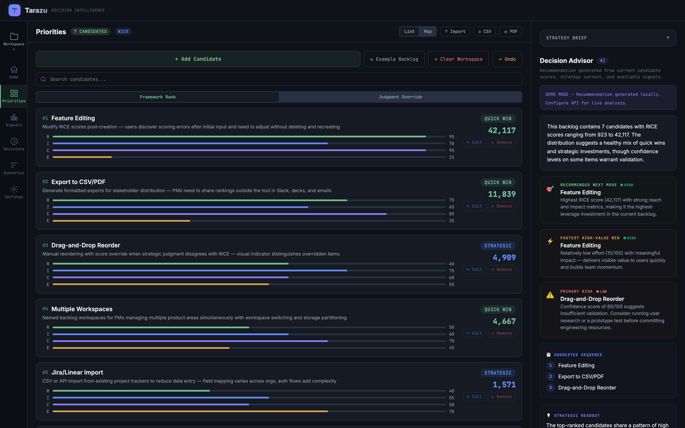
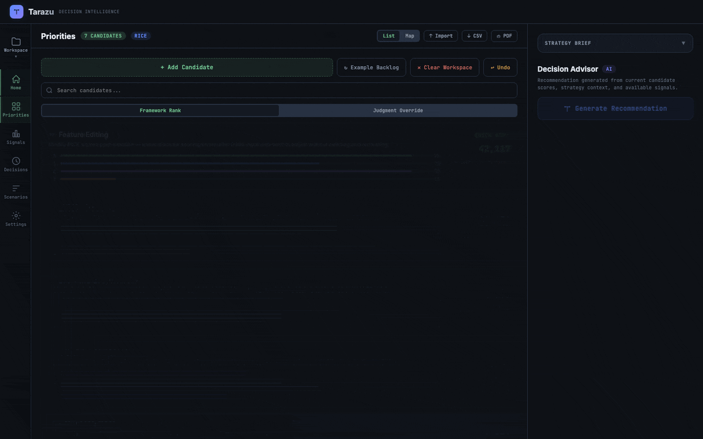
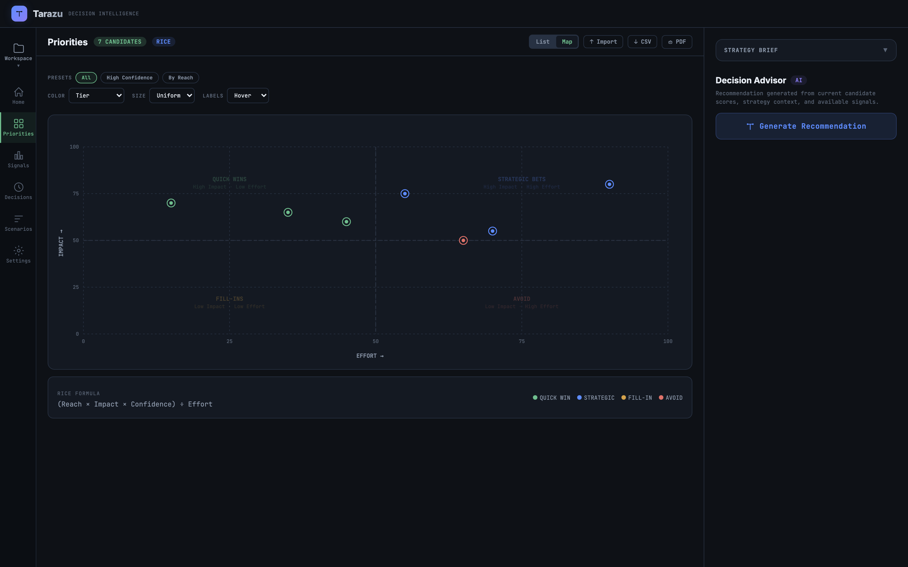
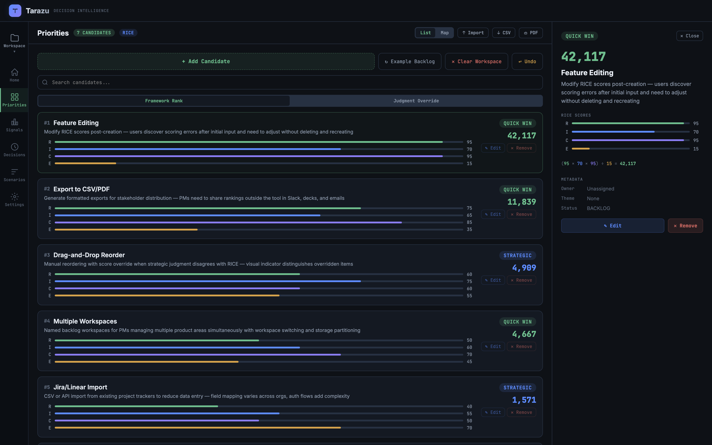
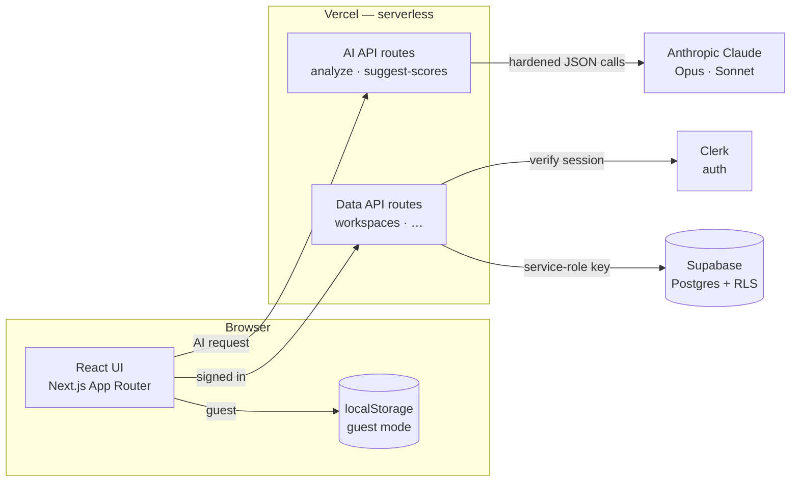

# Tarazu

**Decision intelligence for product teams. Weigh what matters.**

Tarazu — from the Hindi/Urdu word for a balance scale — helps product teams prioritize ideas, compare tradeoffs, capture context, and generate explainable recommendations with structured frameworks like RICE — powered by Claude.

**[tarazu.app](https://tarazu.app)** · Free, and no account needed — guest mode runs entirely in your browser.

[How it works](https://tarazu.app/how-it-works) · [RICE scoring guide](https://tarazu.app/frameworks/rice) · [vs. spreadsheets](https://tarazu.app/vs/spreadsheets) · [FAQ](https://tarazu.app/faq) · [Pricing](https://tarazu.app/pricing)



*RICE-scored candidates on the left, the AI Decision Advisor's recommendation on the right. [Try it live →](https://tarazu.app)*

---

## What It Does

| Feature | Description |
|---------|-------------|
| **Normalized RICE Scoring** | Slider-based input for each dimension on a 1–100 scale with real-time score calculation |
| **Priority Matrix** | Canvas-rendered Effort vs. Impact scatter plot with labeled quadrants |
| **AI Strategy Advisor** | One-click backlog analysis via Claude Opus — returns top priority, quick win, risk flag, sprint plan, and strategic insight |
| **AI Score Suggestions** | Per-candidate scoring via Claude Sonnet, grounded in product context and prior feedback |
| **Persistent Storage** | Features save across sessions via localStorage and cloud sync |
| **Responsive Shell** | Three-panel desktop layout (left rail / center canvas / right rail) collapses to a two-column tablet overlay and a bottom-tab mobile layout via `matchMedia` |

## A Closer Look

**From a scored backlog to an AI recommendation in one click:**



| Tradeoff map | Candidate detail |
| :---: | :---: |
|  |  |
| Effort × Impact with QUICK WIN / STRATEGIC / FILL-IN / AVOID quadrants | Per-candidate RICE breakdown, formula, and metadata |

## Why It Exists

Deciding what to build next is the highest-leverage decision a product team makes, and it usually happens in a spreadsheet assembled the morning of sprint planning. That is what happens when the tooling for a decision is a general-purpose grid: the numbers get captured and the reasoning does not, so three months later nobody can reconstruct why the third item outranked the first.

Tarazu is an argument that this deserves a purpose-built system — one that enforces consistent scoring, shows the tradeoff instead of collapsing it to a single number, and keeps the rationale attached to the decision.

It is not a roadmap tracker and not a replacement for judgement. It ends where a tracking tool begins: with a ranked list, a recorded rationale, and something to measure against later. The AI drafts; a person decides.

## Tech Stack

| Layer | Choice | Why |
|-------|--------|-----|
| Frontend | React + Next.js | Component model, fast builds, file-based routing |
| Visualization | Canvas 2D API | No library dependency; native DPI scaling, custom hit-testing |
| AI — Analysis | Anthropic Claude Opus 4.8 | Structured JSON output for backlog-level strategic analysis (default model, configurable via `ANTHROPIC_MODEL_ANALYSIS`) |
| AI — Scoring | Anthropic Claude Sonnet 4.6 | Fast per-candidate RICE score suggestions (default model, configurable via `ANTHROPIC_MODEL_SUGGESTIONS`) |
| Auth & Data | Clerk + Supabase | Hosted auth with cloud-synced settings and feedback |
| Deploy | Vercel | Zero-config with serverless API routes for the Claude proxy |

## Architecture


```mermaid
flowchart LR
    subgraph Browser
      UI["React UI<br/>Next.js App Router"]
      LS[("localStorage<br/>guest mode")]
    end
    subgraph Vercel["Vercel — serverless"]
      AIAPI["AI API routes<br/>analyze · suggest-scores"]
      DataAPI["Data API routes<br/>workspaces · …"]
    end
    Clerk["Clerk<br/>auth"]
    Supa[("Supabase<br/>Postgres + RLS")]
    Claude["Anthropic Claude<br/>Opus · Sonnet"]

    UI -->|guest| LS
    UI -->|AI request| AIAPI
    UI -->|signed in| DataAPI
    AIAPI -->|hardened JSON calls| Claude
    DataAPI -->|verify session| Clerk
    DataAPI -->|service-role key| Supa
```

In guest mode the app is fully usable against `localStorage`. The AI API routes
(`analyze` / `suggest-scores`) don't verify Clerk or touch Supabase — they read the
request body and proxy Claude with `ANTHROPIC_API_KEY` so the key never reaches the
browser. The data API routes (workspaces and related) are the ones that verify the
Clerk session and talk to Supabase with the service-role key (RLS enabled as
defense-in-depth).

### Highlights

- **Centralized scoring** via `useScored` hook — RICE calculated once per state change, consumed by all components
- **Memoized canvas positions** — hover/selection interactions don't trigger position recalculation
- **Responsive breakpoint** via `window.matchMedia` hook — not CSS-in-JS or broken inline media queries
- **Dual-mode AI** — live Claude analysis via serverless proxy when available; smart demo fallback when not
- **Serverless proxies** — API keys stay server-side in `app/api/analyze/route.js` and `app/api/suggest-scores/route.js`

## Development

Maintainer notes. This repository is published for reference, not licensed for reuse — see [License](#license).

```bash
npm install
npm run dev          # app + /api routes on one process
```

Copy `.env.example` to `.env.local` and add an Anthropic API key to exercise live AI analysis. Without one the advisor falls back to locally generated analysis and labels itself demo mode. Clerk, Supabase, and GA values are all optional; without them the app runs in guest mode against `localStorage`.

| Command | Purpose |
|---------|---------|
| `npm test` / `npm run test:coverage` | Vitest unit suite |
| `npm run test:e2e` | Playwright, including the JS-disabled SEO suite |
| `npm run mutation` | Stryker — does a test actually *assert* the line, not just run it |
| `npm run check:secrets` | Fails if a secret reached the client bundle |
| `npm run check:prerender` | Fails if a public route stopped prerendering to static HTML |
| `npm run submit:indexnow` | Pushes the live sitemap's URLs to Bing/IndexNow after a deploy |
| `npm run icons` | Regenerates the icon assets from `app/icon.svg` |

Adding a public page means adding one row to [`lib/routes.js`](./lib/routes.js) — the sitemap, marketing nav, JSON-LD, and `llms.txt` all read from it, and tests fail if the registry and the filesystem disagree.

## Design Record

The full PRD — competitive analysis, requirements with acceptance criteria, technical architecture, risk mitigations, and launch plan — is in [`docs/Tarazu_PRD.pdf`](./docs/Tarazu_PRD.pdf). The brand system and product design spec is in [`tarazu-brand-system-spec.md`](./tarazu-brand-system-spec.md), and the forward plan for the Validate feature is in [`docs/tarazu-validate-roadmap.md`](./docs/tarazu-validate-roadmap.md).

## License

Proprietary — all rights reserved. See [`LICENSE`](./LICENSE). The source is public so the engineering behind the product can be read and evaluated; it does not grant permission to use, copy, modify, or deploy it.

---

**Designed and built by [Kristen Martino](https://linkedin.com/in/kristenmartino)** · AI-native product manager · MS Business Analytics, UT Dallas · [About](https://tarazu.app/about)
